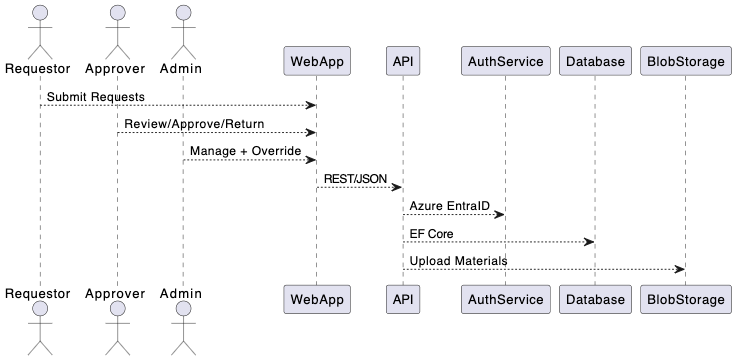

# publication-presentation-request-dotnet
Testing github's new agent on a fresh dotnet application

## Background

In many research and academic institutions, managing the workflow around submitting publications, presentations, and associated abstracts for review and approval is often handled through disconnected tools or manual communication. This results in lost data, missed deadlines, and lack of traceability.

This system is designed to formalize and streamline the request, review, and approval process for publications and presentations. It introduces roles such as requestors, approvers, and administrators, with tailored capabilities to manage the lifecycle of submissions. The application will support structured data capture, reviewer workflows, audit trails, and basic administrative capabilities for testing and exception handling.

## Features
- Role-based access control for Requestors, Approvers, and Admins.
- Multi-step forms for structured data capture.
- Configurable multi-level approval workflows.
- Visual progress timeline for tracking request stages.
- Audit trails for all user actions.

## Getting Started

### Prerequisites
- .NET 9 SDK
- Azure account for Entra ID and Blob Storage setup
- SQL Server Management Studio (for database management)

### Setup Instructions

1. Clone the repository:
   ```bash
   git clone https://github.com/your-repo/publication-presentation-request-dotnet.git
   ```
2. Navigate to the project directory:
   ```bash
   cd publication-presentation-request-dotnet
   ```
3. Install dependencies for both backend and frontend:
   ```bash
   make update-packages
   ```
4. Build the solution:
   ```bash
   make build-all
   ```
5. Run the application:
   - Run the backend application
      ```bash
      make start-backend
      ```
   - Run the frontend application
      ```bash
      make start-frontend
      ```
   - Run both frontend and backend:
      ```bash
      make start-both
      ```
6. Run tests:
   - To run backend tests:
     ```bash
     make test-backend
     ```
   - To run frontend tests:
     ```bash
     make test-frontend
     ```
   - To run all tests:
     ```bash
     make test-all
     ```
7. Lint the code:
   - To lint the backend:
     ```bash
     make lint-backend
     ```
   - To lint the frontend:
     ```bash
     make lint-frontend
     ```
   - To lint both:
     ```bash
     make lint-all
     ```

## Technology Stack
- **Frontend**: Blazor (WebAssembly)
- **Backend**: ASP.NET Core Web API
- **Auth**: Azure Entra ID
- **Database**: Microsoft SQL Server
- **File Storage**: Azure Blob Storage

## UML Diagram


## Contributing
We welcome contributions! Please follow these steps:
1. Fork the repository.
2. Create a new branch for your feature or bugfix.
3. Submit a pull request with a detailed description of your changes.

## CI/CD pipeline using GitHub Actions

### It includes the following steps:

#### Build and Test

Restores dependencies, builds the solution, and runs tests for both frontend and backend.

#### Deploy Backend

Deploys the backend to Azure App Service using the azure/webapps-deploy action.

#### Deploy Frontend

Builds the frontend and deploys it to Azure Static Web Apps using the Azure/static-web-apps-deploy action.

_Note: Make sure to add the required secrets (AZURE_CREDENTIALS and AZURE_STATIC_WEB_APPS_API_TOKEN) to your GitHub repository settings for the deployment steps to work._

## Using the Makefile

To simplify running the application and tests, a `Makefile` has been added to the project. You can use the following commands:

- `make start-backend`: Starts the backend application.
- `make start-frontend`: Starts the frontend application.
- `make test-backend`: Runs the backend tests.
- `make test-frontend`: Runs the frontend tests.
- `make test-all`: Runs both backend and frontend tests sequentially.
- `make run-all`: Runs both backend and frontend applications sequentially.
- `make test-and-run-all`: Runs both backend and frontend tests and applications sequentially.
- `make update-packages`: Restores and updates all project dependencies.
- `make clean`: Cleans the build directories for both backend and frontend.
- `make build-backend`: Builds the backend project.
- `make build-frontend`: Builds the frontend project.
- `make build-all`: Builds both backend and frontend projects.
- `make lint-backend`: Runs the linter for the backend project.
- `make lint-frontend`: Runs the linter for the frontend project.
- `make lint-all`: Runs the linter for both backend and frontend projects.
- `make deploy`: Simulates deploying the application.

This provides a convenient way to manage the project without needing to remember long commands.