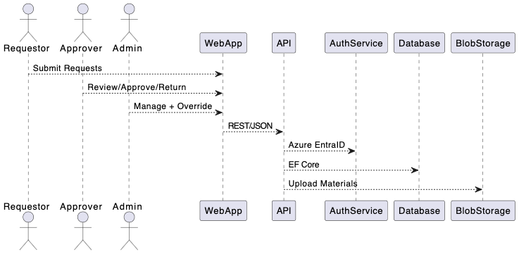

## Requirements

The system must support the core needs of a publication and presentation request workflow, as well as administrative and authentication capabilities.

### Must Have
- Users must authenticate via Azure Entra ID (formerly Azure AD) using Single Sign-On.
- Users must be categorized into roles: Requestor, Approver, and Admin, based on Entra ID group membership.
- Requestors must be able to submit two types of requests: Publications and Presentations.
- Each request must support structured metadata, including:
  - **Publications**: title, authors, abstract, expected completion date, funding sources.
  - **Presentations**: title, authors, presentation type, presenters, venue details, date, travel required (boolean), materials (file uploads).
- Requests must go through a configurable, multi-level approval process.
- Approvers must be able to approve, reject, or return requests to requestors or earlier reviewers.
- Admins must be able to submit and review any request (including their own) for testing purposes.
- Department metadata must be associated with users and stored with requests.
- All user activity should be auditable.
- Forms must follow a multi-stage design with clearly defined sections shared across request types.
- The UI must include a visual progress timeline for each request, displaying current stage, completed stages, and timestamps.
- Each stage transition and override must be timestamped and logged in request metadata.

### Should Have
- Department and unit management UI for admin users.
- Notification system for review actions (email or in-app alerts).
- Basic dashboard showing status summaries for users.
- Search and filtering of requests based on metadata fields.

### Could Have
- Comment threads on request items for review discussions.
- Attachments preview for uploaded materials.
- Export to PDF or CSV for approved submissions.

### Won't Have (MVP)
- Full mobile responsiveness.
- External collaborator logins.
- Grant or journal submission integration.

### Non-Functional Requirements
- **Performance**: The system should handle up to 100 concurrent users without significant degradation.
- **Scalability**: The architecture should support scaling to accommodate future growth.
- **Security**: All sensitive data must be encrypted in transit and at rest.
- **Availability**: The system should have 99.9% uptime.

### Compatibility and Version Requirements

- **Frontend**: Blazor (WebAssembly) using .NET 8, compatible with modern browsers (Chrome, Edge, Firefox, Safari).
- **Backend**: ASP.NET Core Web API using .NET 8, with middleware for Azure Entra ID and Azure Blob Storage.
- **Database**: Microsoft SQL Server 2022 or Azure SQL Database, using Entity Framework Core 8.
- **Authentication**: Azure Entra ID with Microsoft.Identity.Web SDK (latest version compatible with .NET 8).
- **File Storage**: Azure Blob Storage with Azure.Storage.Blobs SDK (latest version compatible with .NET 8).
- **Development Environment**: Visual Studio 2022 or Visual Studio Code with .NET extensions, tested on macOS and Windows.
- **Testing Frameworks**: xUnit or NUnit for unit testing, Microsoft.AspNetCore.TestHost for integration testing, and bUnit for Blazor UI testing.
- **Deployment**: Azure App Service for hosting, with CI/CD pipelines using GitHub Actions and Azure DevOps.

## Method

### Architecture Overview

- **Frontend**: Blazor (WebAssembly), using a component-based multi-step form builder and progress timeline UI.
- **Backend**: ASP.NET Core Web API (.NET 8), enforcing role-based access control and business logic.
- **Auth**: Azure Entra ID integration with Microsoft Identity Platform for SSO and group-based role assignment.
- **Database**: Microsoft SQL Server using Entity Framework Core for ORM and migrations.
- **File Storage**: Azure Blob Storage for uploaded materials.
- **Logging & Audit**: All actions and stage transitions logged via a dedicated `RequestLogs` table and middleware.

### Component Diagram



### Workflow Stages

Each request progresses through the following fixed stages:

1. **Draft**
2. **Submitted**
3. **Under Review**
4. **Returned**
5. **Approved**
6. **Post-Clearance**

Each stage transition must include timestamped metadata and details about the actor responsible for the action.

---

### Progress Timeline UI

The system must include a visual component (vertical or horizontal) to represent the progress of a request through its stages. This component should include nodes for each stage with the following details:

- **Stage Name**
- **Start/End Timestamp**
- **Responsible Role/User**
- **Action Description** (e.g., approved, returned, reset, etc.)

### Database Schema (Simplified)

### Users Table

| Column Name       | Data Type         | Description                              |
|-------------------|-------------------|------------------------------------------|
| **Id**            | UNIQUEIDENTIFIER | Primary Key                              |
| **AzureAdObjectId** | NVARCHAR(64)    | Azure AD Object ID for the user          |
| **DisplayName**   | NVARCHAR(255)    | Full name of the user                    |
| **Email**         | NVARCHAR(255)    | Email address of the user                |
| **Role**          | NVARCHAR(50)     | User role: Requestor, Approver, or Admin |
| **Department**    | NVARCHAR(255)    | Department associated with the user      |
| **DeletedAt**     | DATETIME         | Timestamp when the user was soft deleted |

### Requests Table

| Column Name       | Data Type         | Description                              |
|-------------------|-------------------|------------------------------------------|
| **Id**            | UNIQUEIDENTIFIER | Primary Key                              |
| **Type**          | NVARCHAR(50)     | Request type: Publication or Presentation|
| **Title**         | NVARCHAR(255)    | Title of the request                     |
| **Abstract**      | NVARCHAR(MAX)    | Abstract or description of the request   |
| **Authors**       | NVARCHAR(MAX)    | List of authors                          |
| **SubmitterId**   | UNIQUEIDENTIFIER | Foreign Key to `Users` table             |
| **CurrentStage**  | NVARCHAR(50)     | Current stage of the request             |
| **Status**        | NVARCHAR(50)     | Status: Submitted, Approved, Returned, etc. |
| **CreatedAt**     | DATETIME         | Timestamp when the request was created   |
| **UpdatedAt**     | DATETIME         | Timestamp when the request was last updated |
| **CreatedBy**     | UNIQUEIDENTIFIER | Foreign Key to `Users` table             |
| **UpdatedBy**     | UNIQUEIDENTIFIER | Foreign Key to `Users` table             |
| **DeletedAt**     | DATETIME         | Timestamp when the request was soft deleted |

### RequestStages Table

| Column Name       | Data Type         | Description                              |
|-------------------|-------------------|------------------------------------------|
| **Id**            | INT              | Primary Key                              |
| **RequestId**     | UNIQUEIDENTIFIER | Foreign Key to `Requests` table          |
| **Stage**         | NVARCHAR(50)     | Stage name                               |
| **StartedAt**     | DATETIME         | Timestamp when the stage started         |
| **EndedAt**       | DATETIME         | Timestamp when the stage ended           |
| **ActorId**       | UNIQUEIDENTIFIER | Foreign Key to `Users` table             |
| **Action**        | NVARCHAR(50)     | Action performed: Approved, Returned, Reset |
| **Notes**         | NVARCHAR(MAX)    | Additional notes for the stage           |

### RequestDetails Table

| Column Name       | Data Type         | Description                              |
|-------------------|-------------------|------------------------------------------|
| **RequestId**     | UNIQUEIDENTIFIER | Foreign Key to `Requests` table          |
| **FundingInfo**   | NVARCHAR(MAX)    | Funding information (for Publications)   |
| **PresentationType** | NVARCHAR(100) | Type of presentation                     |
| **Venue**         | NVARCHAR(255)    | Venue details                            |
| **PresentationDate** | DATETIME      | Date of the presentation                 |
| **NeedsTravel**   | BIT              | Indicates if travel is required          |
| **MaterialsUrl**  | NVARCHAR(500)    | URL for uploaded materials               |

### RequestLogs Table

| Column Name       | Data Type         | Description                              |
|-------------------|-------------------|------------------------------------------|
| **Id**            | UNIQUEIDENTIFIER | Primary Key                              |
| **RequestId**     | UNIQUEIDENTIFIER | Foreign Key to `Requests` table          |
| **Action**        | NVARCHAR(50)     | Action performed                         |
| **ActorId**       | UNIQUEIDENTIFIER | Foreign Key to `Users` table             |
| **Timestamp**     | DATETIME         | Timestamp of the action                  |
| **Notes**         | NVARCHAR(MAX)    | Additional notes for the action          |

### Database Schema Updates

#### Improvements

1. **Data Integrity**:
   - Added `UNIQUE` constraints to `AzureAdObjectId` and `Email` in the `Users` table.

2. **Indexes**:
   - Added indexes to frequently queried columns:
     - `Status` and `SubmitterId` in `Requests`
     - `RequestId` in `RequestStages` and `RequestLogs`

3. **Audit Fields**:
   - Added `CreatedBy` and `UpdatedBy` fields to the `Requests` table.

4. **Soft Deletes**:
   - Added `DeletedAt` column to `Users` and `Requests` tables for soft delete functionality.

5. **Default Values**:
   - Set default value for `Status` in `Requests` to `Pending`.
   - Set default value for `NeedsTravel` in `RequestDetails` to `0` (false).

## Admin Overrides

### Capabilities

Admins have the ability to:

- **Reset Requests**: Reset any request to any stage.
- **Add Notes**: Provide override reasons as notes.

All override actions are logged in the `RequestLogs` table for auditing purposes.

### Request API Specification

#### Endpoints

- **List Requests**  
    `GET /api/requests`  
    Retrieves a list of all requests, with support for filtering and searching.

- **Get Single Request**  
    `GET /api/requests/{id}`  
    Retrieves details of a specific request by its ID.

- **Create New Request**  
    `POST /api/requests`  
    Creates a new request in the draft stage.

- **Update Request Fields**  
    `PUT /api/requests/{id}`  
    Updates the fields of an existing request.

- **Submit Request**  
    `POST /api/requests/{id}/submit`  
    Submits a draft request for review.

- **Perform Action on Request**  
    `POST /api/requests/{id}/action`  
    Allows actions such as approve, reject, return, or override on a request.

- **Get Request Timeline**  
    `GET /api/requests/{id}/timeline`  
    Retrieves the stage history of a specific request.

- **Get Metadata for Request Types**  
    `GET /api/requests/types/metadata`  
    Retrieves the dynamic field structure for publication and presentation request types.

### yaml

```
openapi: 3.0.1
info:
  title: Publication and Presentation Request API
  version: 1.0.0
paths:
  /api/requests:
    get:
      summary: List all requests
      parameters:
        - in: query
          name: type
          schema:
            type: string
            enum: [Publication, Presentation]
        - in: query
          name: stage
          schema:
            type: string
        - in: query
          name: department
          schema:
            type: string
      responses:
        '200':
          description: List of requests
    post:
      summary: Create a new request
      requestBody:
        required: true
        content:
          application/json:
            schema:
              $ref: '#/components/schemas/RequestCreate'
      responses:
        '201':
          description: Created
  /api/requests/{id}:
    get:
      summary: Get Single Request
      parameters:
        - in: path
          name: id
          required: true
          schema:
            type: string
      responses:
        '200':
          description: Details of a specific request
    put:
      summary: Update Request Fields
      parameters:
        - in: path
          name: id
          required: true
          schema:
            type: string
      requestBody:
        required: true
        content:
          application/json:
            schema:
              $ref: '#/components/schemas/RequestUpdate'
      responses:
        '200':
          description: Updated
  /api/requests/{id}/submit:
    post:
      summary: Submit Request
      parameters:
        - in: path
          name: id
          required: true
          schema:
            type: string
      responses:
        '200':
          description: Submitted
  /api/requests/{id}/action:
    post:
      summary: Perform Action on Request
      parameters:
        - in: path
          name: id
          required: true
          schema:
            type: string
      requestBody:
        required: true
        content:
          application/json:
            schema:
              $ref: '#/components/schemas/RequestAction'
      responses:
        '200':
          description: Action performed
  /api/requests/{id}/timeline:
    get:
      summary: Get Request Timeline
      parameters:
        - in: path
          name: id
          required: true
          schema:
            type: string
      responses:
        '200':
          description: Timeline of the request
  /api/requests/types/metadata:
    get:
      summary: Get Metadata for Request Types
      responses:
        '200':
          description: Metadata for request types
# ...more endpoints continue below
```